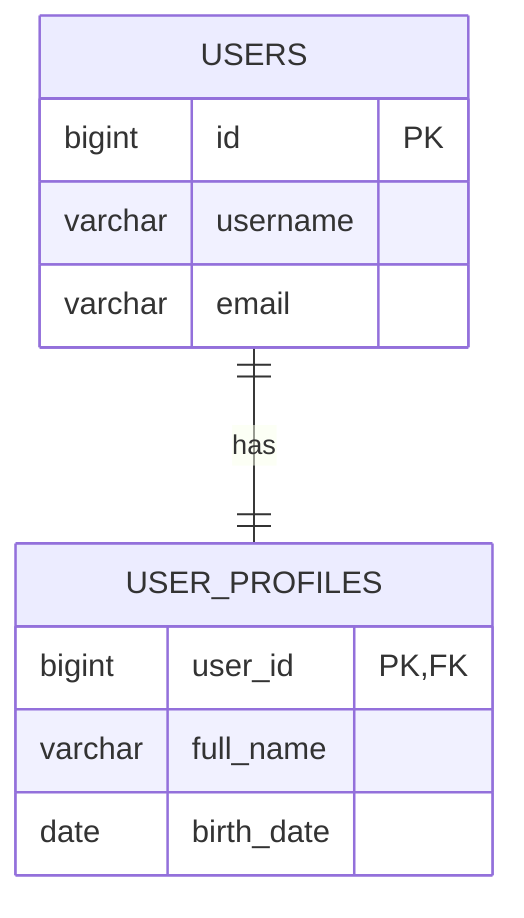
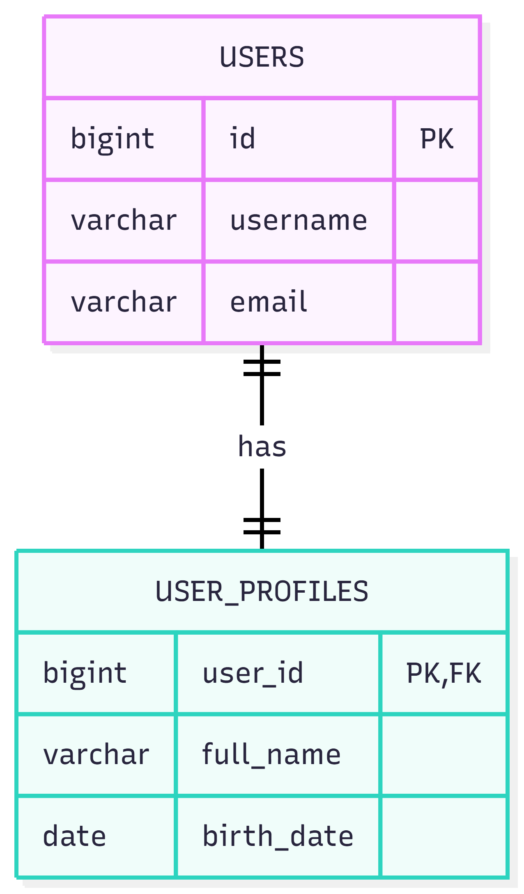
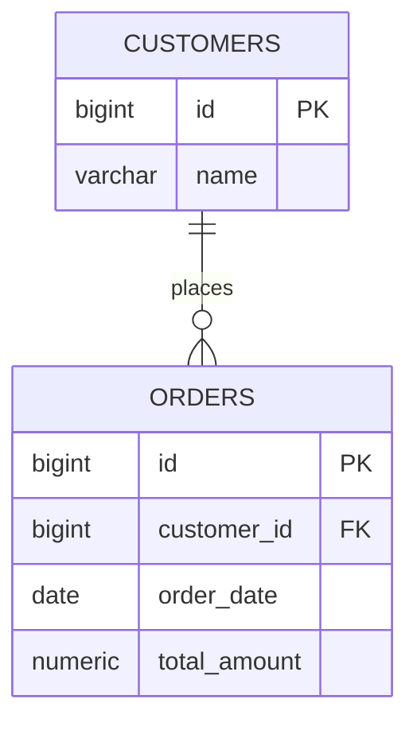
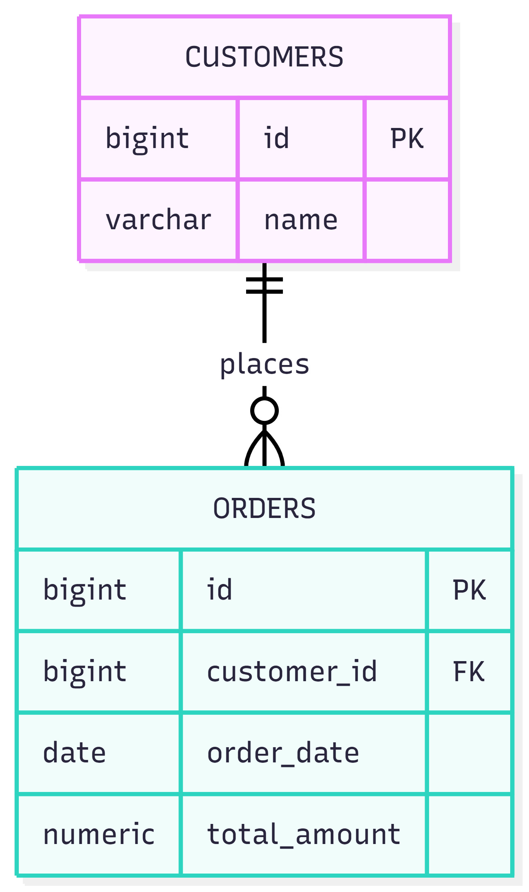
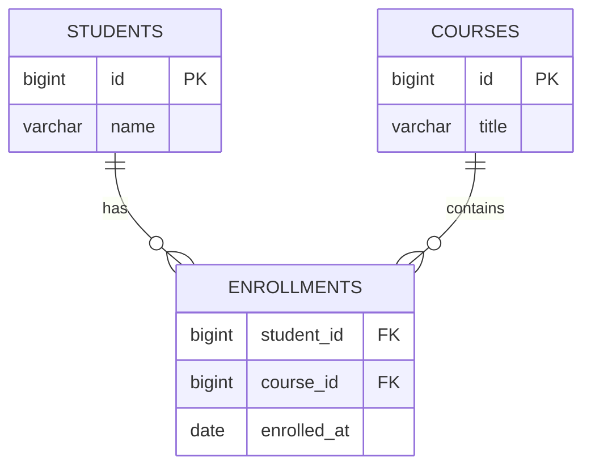
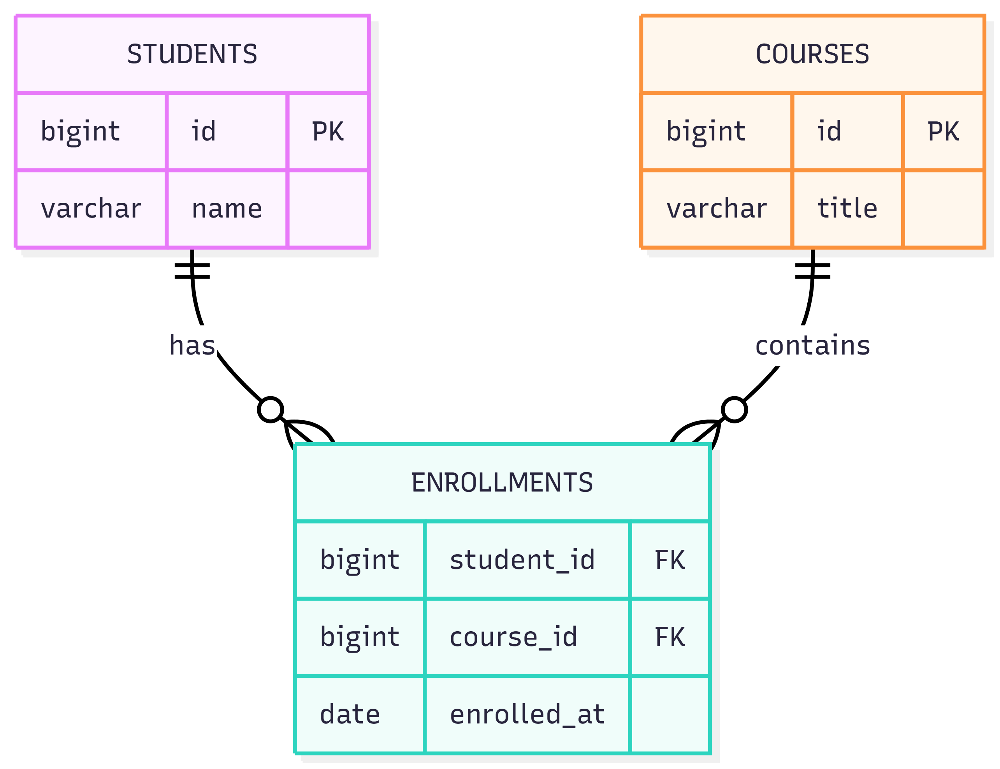

# Database Relationships & Table Design (2025)

This guide explains the three core relational database relationships:

- **One-to-One (1:1)**
- **One-to-Many (1:N)**
- **Many-to-Many (M:N)**

…and how to convert each into **tables**, including:

- ER-style diagrams
- production-oriented SQL **DDL** (constraints, indexes)
- example tables with sample rows showing *how data is stored*

> Assumptions
> - SQL examples are written in a portable style (close to PostgreSQL/MySQL).
> - If your DB is different (SQL Server/Oracle), constraints and identity columns may vary.

---

## Quick rule: how relationships map to tables

| Relationship | How to model in tables | Where the foreign key lives |
|---|---|---|
| 1:1 | Put FK on the optional side (or split into two tables) + enforce **UNIQUE** | Usually in the table that depends on the other |
| 1:N | Add FK on the **many** side | In the child table |
| M:N | Use a **junction (join) table** with two FKs | In the junction table |

---

## 1) One-to-One (1:1)

### Example domain
- A `user` may have **one** `user_profile`.
- A `user_profile` belongs to **exactly one** `user`.

### Diagram



**Visual placeholder**



*Caption: 1:1 relationship where USER_PROFILES references USERS, with user_id both FK and PK to enforce exactly one profile per user.*

### DDL (1:1 using shared primary key)

```sql
CREATE TABLE users (
  id        BIGINT PRIMARY KEY,
  username  VARCHAR(50) NOT NULL UNIQUE,
  email     VARCHAR(255) NOT NULL UNIQUE
);

-- Shared PK strategy: the profile row shares the same ID as the users row
CREATE TABLE user_profiles (
  user_id    BIGINT PRIMARY KEY,
  full_name  VARCHAR(200) NOT NULL,
  birth_date DATE,

  CONSTRAINT fk_user_profiles_user
    FOREIGN KEY (user_id)
    REFERENCES users(id)
    ON DELETE CASCADE
);
```

### Sample stored data

**users**

| id | username | email |
|---:|---|---|
| 1 | alice | alice@example.com |
| 2 | bob | bob@example.com |

**user_profiles**

| user_id | full_name | birth_date |
|---:|---|---|
| 1 | Alice Johnson | 1995-04-12 |
| 2 | Bob Smith | 1990-11-03 |

### Key implementation notes (best practice)

- Use 1:1 **only when the data is truly optional/secondary** or has different access patterns (e.g., large profile blob, sensitive data).
- Enforce 1:1 at the database level using:
  - `PRIMARY KEY` + `FOREIGN KEY` (shared PK), or
  - `FOREIGN KEY` + `UNIQUE`.

---

## 2) One-to-Many (1:N)

### Example domain
- A `customer` can have many `orders`.
- Each `order` belongs to exactly one `customer`.

### Diagram



**Visual placeholder**



*Caption: 1:N relationship. The foreign key is stored in the ORDERS table (the many side).*

### DDL (1:N with FK + index)

```sql
CREATE TABLE customers (
  id   BIGINT PRIMARY KEY,
  name VARCHAR(150) NOT NULL
);

CREATE TABLE orders (
  id           BIGINT PRIMARY KEY,
  customer_id  BIGINT NOT NULL,
  order_date   DATE NOT NULL,
  total_amount NUMERIC(12,2) NOT NULL,

  CONSTRAINT fk_orders_customer
    FOREIGN KEY (customer_id)
    REFERENCES customers(id)
    ON DELETE RESTRICT
);

-- Index helps joins and customer order lookups
CREATE INDEX idx_orders_customer_id ON orders(customer_id);
```

### Sample stored data

**customers**

| id | name |
|---:|---|
| 10 | ACME Corp |
| 11 | Globex |

**orders**

| id | customer_id | order_date | total_amount |
|---:|---:|---|---:|
| 1001 | 10 | 2025-12-10 | 1200.00 |
| 1002 | 10 | 2025-12-15 | 75.50 |
| 1003 | 11 | 2025-12-20 | 512.99 |

### Key implementation notes (best practice)

- Put the FK on the **child** table (the “many” side).
- Index child FKs (`orders.customer_id`) for performance.
- Choose `ON DELETE` behavior based on business rules:
  - `CASCADE` (delete orders when customer is deleted)
  - `RESTRICT/NO ACTION` (prevent deletion if dependent rows exist)
  - `SET NULL` (only if nullable FK makes sense)

---

## 3) Many-to-Many (M:N)

### Example domain
- A `student` can enroll in many `courses`.
- A `course` can have many `students`.

In relational databases, M:N is implemented using a **junction (join) table**.

### Diagram



**Visual placeholder**



*Caption: M:N relationship using ENROLLMENTS as a junction table linking STUDENTS and COURSES. The junction table stores two FKs and optional extra attributes like enrolled_at.*

### DDL (M:N junction table + composite PK)

```sql
CREATE TABLE students (
  id   BIGINT PRIMARY KEY,
  name VARCHAR(150) NOT NULL
);

CREATE TABLE courses (
  id    BIGINT PRIMARY KEY,
  title VARCHAR(200) NOT NULL
);

CREATE TABLE enrollments (
  student_id BIGINT NOT NULL,
  course_id  BIGINT NOT NULL,
  enrolled_at DATE NOT NULL,

  CONSTRAINT pk_enrollments PRIMARY KEY (student_id, course_id),

  CONSTRAINT fk_enrollments_student
    FOREIGN KEY (student_id)
    REFERENCES students(id)
    ON DELETE CASCADE,

  CONSTRAINT fk_enrollments_course
    FOREIGN KEY (course_id)
    REFERENCES courses(id)
    ON DELETE CASCADE
);

-- Helpful indexes for reverse lookups
CREATE INDEX idx_enrollments_course_id ON enrollments(course_id);
```

### Sample stored data

**students**

| id | name |
|---:|---|
| 200 | Maya |
| 201 | Zaid |
| 202 | Lina |

**courses**

| id | title |
|---:|---|
| 300 | Database Fundamentals |
| 301 | Spring Boot Security |

**enrollments**

| student_id | course_id | enrolled_at |
|---:|---:|---|
| 200 | 300 | 2025-09-01 |
| 200 | 301 | 2025-09-03 |
| 201 | 300 | 2025-09-02 |
| 202 | 301 | 2025-09-04 |

### Key implementation notes (best practice)

- Always use a junction table for M:N.
- Prefer a **composite primary key** `(student_id, course_id)` when:
  - duplicates must be prevented
  - the pair uniquely identifies the relationship
- If you need additional attributes (grade, status, metadata), the junction table is the right place.

---

## Common pitfalls

1. **Missing constraints**: model rules in SQL (FK + UNIQUE/PK) so bugs don’t silently corrupt data.
2. **No indexes on foreign keys**: leads to slow joins.
3. **Using M:N without a junction table**: not supported in relational design.
4. **Wrong delete behavior**: `CASCADE` is powerful but can delete more than intended.

---

## Summary

- **1:1**: enforce with `UNIQUE` or shared primary key.
- **1:N**: foreign key lives on the “many” side.
- **M:N**: junction table + two foreign keys (often composite PK).

